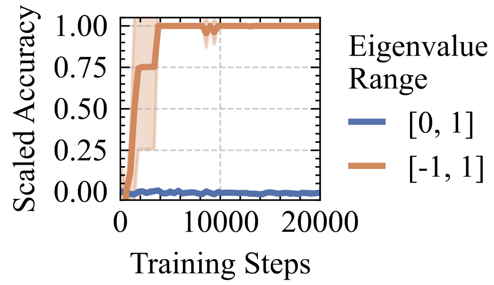

# Unlocking State-Tracking in Linear RNNs Through Negative Eigenvalues
<p align="center">
    
</p>

## Abstract:
> Linear Recurrent Neural Networks (LRNNs) such as Mamba, RWKV, GLA, mLSTM, and DeltaNet have emerged as efficient alternatives to Transformers in large language modeling, offering linear scaling with sequence length and improved training efficiency. However, LRNNs struggle to perform state-tracking which may impair performance in tasks such as code evaluation or tracking a chess game. Even parity, the simplest state-tracking task, which non-linear RNNs like LSTM handle effectively, cannot be solved by current LRNNs. Recently, Sarrof et al. (2024) demonstrated that the failure of LRNNs like Mamba to solve parity stems from restricting the value range of their diagonal state-transition matrices to [0,1] and that incorporating negative values can resolve this issue. We extend this result to non-diagonal LRNNs, which have recently shown promise in models such as DeltaNet. We prove that finite precision LRNNs with state-transition matrices having only positive eigenvalues cannot solve parity, while complex eigenvalues are needed to count modulo 3. Notably, we also prove that LRNNs can learn any regular language when their state-transition matrices are products of identity minus vector outer product matrices, each with eigenvalues in the range [−1,1]. Our empirical results confirm that extending the eigenvalue range of models like Mamba and DeltaNet to include negative values not only enables them to solve parity but consistently improves their performance on state-tracking tasks. Furthermore, pre-training LRNNs with an extended eigenvalue range for language modeling achieves comparable performance and stability while showing promise on code and math data. Our work enhances the expressivity of modern LRNNs, broadening their applicability without changing the cost of training or inference.


## Requirements
- Python >= 3.11
## Dependencies
```
$ pip install -r requirements.in
```
## Experiments
We provide all the code necessary to reproduce the experiments in the chomsky hierarchy as implemented by xlstm. This is a composition of repositories. It contains the flash-linear attention library with extended eigenvalue range for DeltaNet and Mamba with similar modifications but for CUDA code of the associative scan.

To install, please first go to the `flash-linear-attention` directory and run the following command:
```
$ pip install -e .
```
Then, go to the `mamba_dev` directory and run the following command:
```
$ pip install -e .
```
To run the experiments please go to the xlstm directory.
### Chomsky Hierarchy
#### Parity
mLSTM:
```
$ PYTHONPATH=$PWD python experiments/main.py --config=experiments/parity_xlstm10.yaml 
```
sLSTM:
```
$ PYTHONPATH=$PWD python experiments/main.py --config=experiments/parity_xlstm01.yaml 
```
---
Mamba [0, 1]:
```
$ PYTHONPATH=$PWD python experiments/main.py --config=experiments/parity_mamba.yaml 
```
Mamba [-1, 1]:
```
$ PYTHONPATH=$PWD python experiments/main.py --config=experiments/parity_mamba_2.yaml 
```
---
DeltaNet [0, 1]:
```
$ PYTHONPATH=$PWD python experiments/main.py --config=experiments/parity_delta_net.yaml 
```
DeltaNet [-1, 1]:
```
$ PYTHONPATH=$PWD python experiments/main.py --config=experiments/parity_delta_net_2.yaml 
```

#### Modular Arithmetic w/o brackets 
mLSTM:
```
$ PYTHONPATH=$PWD python experiments/main.py --config=experiments/mod_arithmetic_xlstm10.yaml 
```
sLSTM:
```
$ PYTHONPATH=$PWD python experiments/main.py --config=experiments/mod_arithmetic_xlstm01.yaml 
```
---
Mamba [0, 1]:
```
$ PYTHONPATH=$PWD python experiments/main.py --config=experiments/mod_arithmetic_mamba.yaml 
```
Mamba [-1, 1]:
```
$ PYTHONPATH=$PWD python experiments/main.py --config=experiments/mod_arithmetic_mamba_2.yaml 
```
---
DeltaNet [0, 1]:
```
$ PYTHONPATH=$PWD python experiments/main.py --config=experiments/mod_arithmetic_delta_net.yaml 
```
DeltaNet [-1, 1]:
```
$ PYTHONPATH=$PWD python experiments/main.py --config=experiments/mod_arithmetic_delta_net_2.yaml 
```


#### Modular Arithmetic w/ brackets 
mLSTM:
```
$ PYTHONPATH=$PWD python experiments/main.py --config=experiments/mod_arithmetic_with_brackets_xlstm10.yaml 
```
sLSTM:
```
$ PYTHONPATH=$PWD python experiments/main.py --config=experiments/mod_arithmetic_with_brackets_xlstm01.yaml 
```
---
Mamba [0, 1]:
```
$ PYTHONPATH=$PWD python experiments/main.py --config=experiments/mod_arithmetic_with_brackets_mamba.yaml 
```
Mamba [-1, 1]:
```
$ PYTHONPATH=$PWD python experiments/main.py --config=experiments/mod_arithmetic_with_brackets_mamba_2.yaml 
```
---
DeltaNet [0, 1]:
```
$ PYTHONPATH=$PWD python experiments/main.py --config=experiments/mod_arithmetic_with_brackets_delta_net.yaml 
```
DeltaNet [-1, 1]:
```
$ PYTHONPATH=$PWD python experiments/main.py --config=experiments/mod_arithmetic_with_brackets_delta_net_2.yaml 
```
